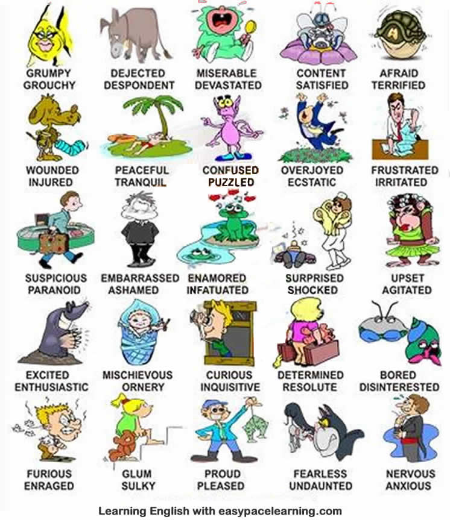

= Feelings and emotions

== row 1
* 更年期
** 脾气暴躁 grumpy (注意区别clumsy): Some folks think I'm a grumpy old man.
** 不高兴的 gronchy: Your grandmother has nothing to stop her from being bored, grouchy, and lonely.

* 低头的小毛驴
** 沮丧的 dejected: In retrospect, I was a sad little boy and a standard-issue, shiftless, egotistical, **dejected** teen-ager
** 沮丧，失望的 despondent: He was despondent over the breakup of his marriage

* 大哭的小孩
** 悲伤的 miserable: I took a series of badly paid secretarial jobs which made me really miserable.
** 震惊的 devastated: Teresa was devastated, her dreams shattered.

* 采到蜂蜜的小蜜蜂
** 满意的 content
** 满意的 satisfied

* 被惊吓的乌龟
** 害怕的 afraid
** 感到恐惧的 terrified

/////////////////////////
/////////////////////////

== row 2

* 受伤的：受伤的snoopy
** wounded
** injured

* 平静祥和：躺在沙滩上
** relax
** 平静的 peaceful
** 安宁的 tranquil: The tranquil atmosphere of the inn allows guests to feel totally at home.

* 迷惑不解：好多只手
** confused
** puzzled

* 喜出望外：发财的老板
** 狂喜的 overjoyed
** 狂喜的 ecstatic

* 恼羞成怒：被工作搞得发脾气的白领
** 挫折的 frustrated
** 恼怒的 irritated: Not surprisingly, her teacher is getting irritated with her

== row 3
* 可疑的：带着可疑行李的人
** suspicous
** paranoid about something　有偏执倾向的

* 尴尬的：尴尬的夹着腿的小屁孩
** embarrassed
** ashamed

* 迷恋的：发情的小青蛙
** en-amored of/by sth: I’m always kind of surprised by how **enamored** men are by women
** infatuated with sb: He was utterly *infatuated with* her

* 震惊的：看见护士抱出三胞胎的爸爸
** shocked
** surprised
** overwhelmed 不知所措

* 不安的，因觉得自己穿着丑陋而不安
** upset
** 激动焦虑的 agitated: The crowd was agitated by his speech.

== row 4
* 激动的，土拨鼠看到春天
** 激动的 exicted
** 热情的 enthusiastic: Tom was very enthusiastic about the place.

* 淘气的，拿弹弓的婴儿
** 淘气的 mis-chievous
** 刻薄暴躁的 ornery: The old lady was still being ornery, but at least she had consented to this visit.
** naughty

* 好奇的：拿望远镜的小伙子
** 好奇的 curious
** 爱打听的 inquisitive 

* 心意已决的，离家出走的妇女
** determined
** resolute　果断: Voters perceive him as a decisive and resolute international leader
** assertive 独断的，自信

* 无聊的，螃蟹看蜗牛很无聊
** bored
** disinterested

== row 5
* 愤怒的，黄头发的白领
** furious
** en-raged

* 阴郁，低头上楼的女孩
** 忧郁的 glum
** 阴郁的 sulky
** 阴郁的 gloomy

* 钓到鱼的人
** 自豪的 proud
** 高兴的 pleased

* 无惧的，不怕揍的老鼠
** 无畏的 fearless
** 无畏勇敢的 undaunted: But for those undaunted, here's our guide to circumventing internet censorship.

* 紧张的，要演讲的人
** 不安的 nervous
** 担忧的 anxious

== happy
* delighted
* hilarious
* pleased
* satisfied
* thrilled
* joyful

.例句
[NOTE]
====
* She is a pleasant baby
* I am on cloud nine
* He is a very pleasant person
* I am joyful
* We are overjoyed with the results
====

== sad
* miserable
* unfortunate
* depressed
* gloomy
* heart broken
* unhappy

.记忆方法
[NOTE]
Mudgh，有点掉土（mud）里了

== disappointed
* frustrated
* discontented