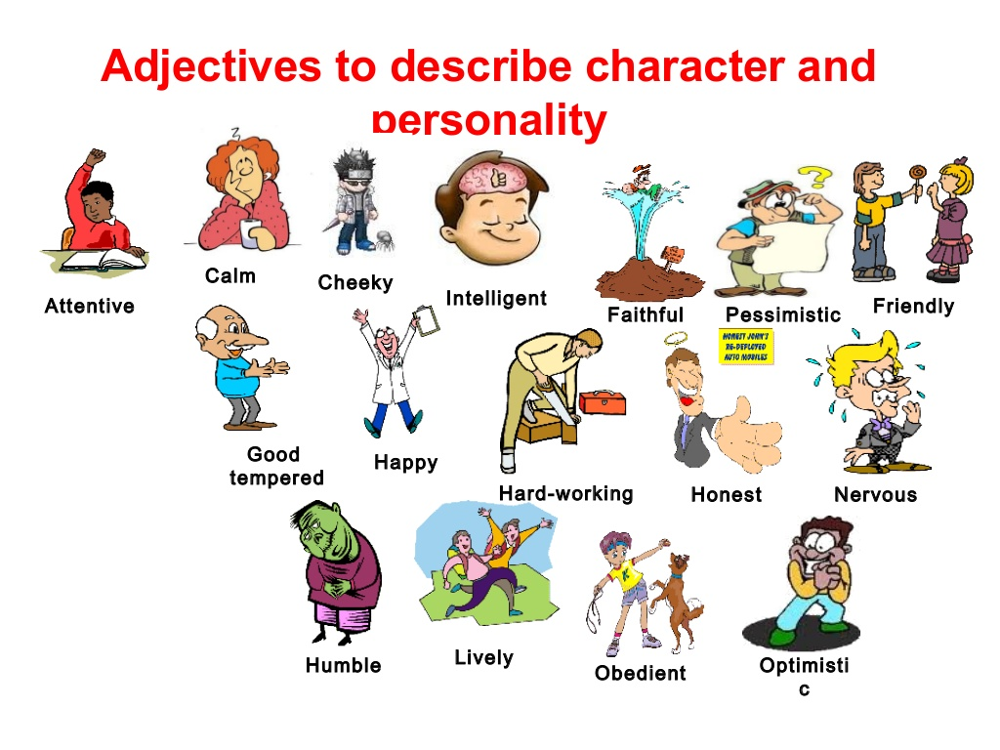
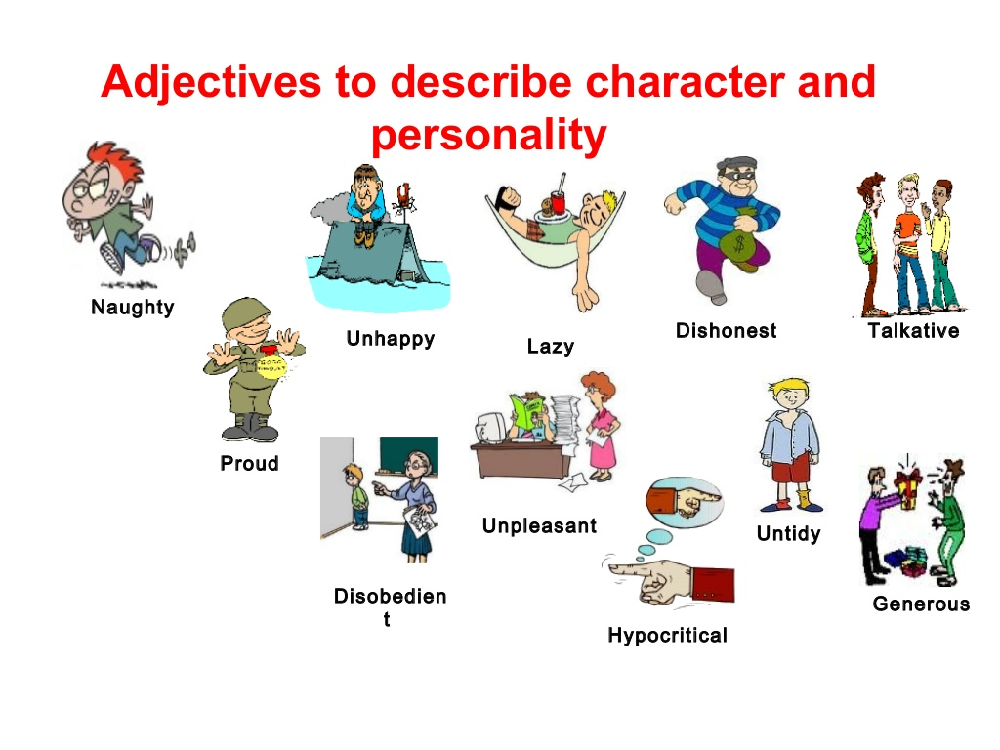

= Personality

== 星座

|======================================================
| 星座     `| 英语      | Positive              | Negative 
| Aries     | 白羊      | adventurous           | impulsive
| Taurus    | 金牛      | persistent            | inflexiable
| Gemini    | 双子      | eloquent 有说服力     | superfacious 
| Cancer    | 巨蟹      | cautious              | hypersensitive
| Leo       | 狮子      | expansive 豪爽        | intolerant 不容忍
| Virgo     | 处女      | meticulous 一丝不苟   | fussy 爱挑剔的
| Libro     | 天平      | sociable 好社交的     | indecisive 犹豫不决的
| Scorpio   | 天蝎      | forceful 坚强，强有力 | obstinate 顽固的
| sagittarius | 射手    | jovial 天性快乐       | tactless 不老练，不机智
| Capricorn | 摩羯      | disciplined 有纪律的  | miserly 吝啬的
| Aquarius  | 水瓶（phoebe）      | humanitarian 人道主义的 | unpredictable 不可预期的
| Pisces    | 双鱼      | compassionate 富同情心| vague 含糊不清
|======================================================

== 其他

* 过度小心的 overcautious
* 胆小的 timid
* 勤劳的 industrious, diligent, hard-working
* 节俭的 frugal, economical, thrifty, provident, prudent
* 好人good person, wondful person
* 吃苦耐劳的 tough, who can *stand hard works*
* 走极端 go to(run to/lives in) the extremes
* (人) 卓越 execellence
* 杰出的 brilliant
* 独立 self-dependent
* 老年人群 the elderly people
* 有远见的 far-sighted
* 鼠目寸光的 short-sighted
* 善变的 flexiable
* 有毅力的 perserving
* 鲁莽的 crude
* 严肃的 serious, smileless
* 阳光的 sunny
* 老练的 sophisticated
* 严谨的 rigorous
* 有胆略的 bold
* 沉闷的 bored
* 渴望 desire, anxiety
* 渴望的 desired, 
* 有上进心的 aggressive, motivated
* 有野心的 ambitious
* 体贴的 considerate, thoughtful
* 有合作精神的 cooperative
* 宽宏大量的　forgiving
* 有教养的 well-behaved
* 有主见的 independent
* 和蔼可亲的 easy-going
* 好奇的 curious

== 图片

image::Reference/personality3.jpg[]