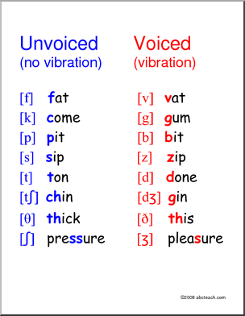

== voiced和unvoiced

- consonant分为voiced和unvoiced.
- 在英语中，所有的元音都是voiced

== gh结尾的有四个, ough, igh, eigh, augh
- 根据rule 28，只能在单词结尾或者t前面，gh不发音或发f
- xxgh和xx直接的发音没啥关系……

=== e开头10个：

- ed: 动词过去式结尾，三种发音：
** [ĕd]: d/t结尾发单独的音节（如traded, counted, supported, planted）
** [d]: voiced（元音和浊辅音）后面发浊音的，played, stormed, excused
** [t]:unvoiced（清辅音）后面发t, stamped, matched, financed，thanked

- e,a,o最多，且都有跟i,r,w,y的组合10011
- o开头10个
- a开头7个
- c开头4个
- i开头4个

BASIC_PHONOGRAMS.docx[Basic phonogrames]

== 
- won't
- want
- money
