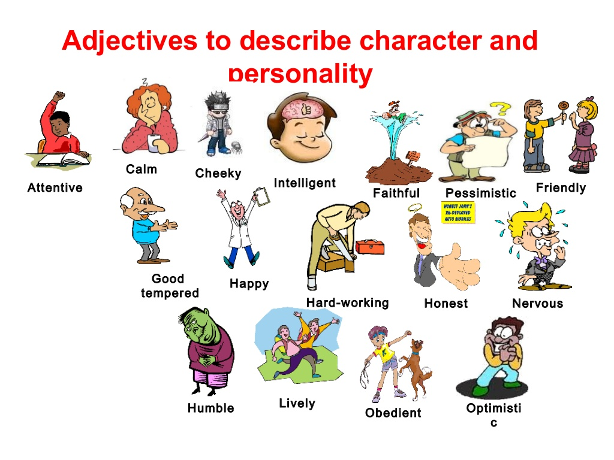
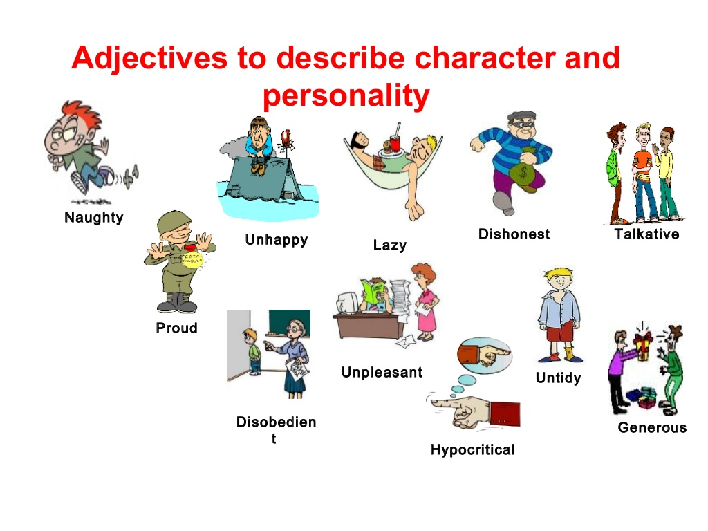
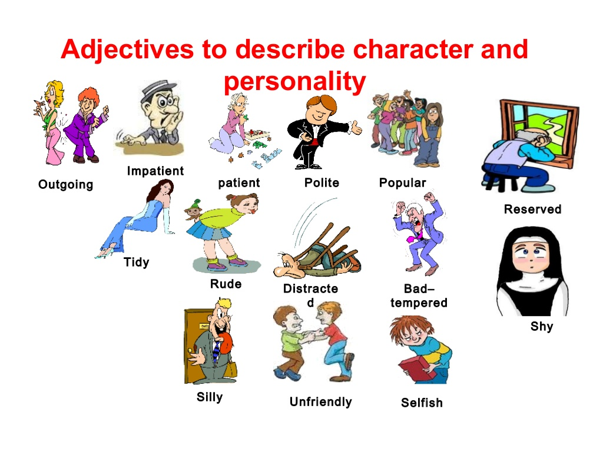

= Personality

== 星座

|======================================================
| 星座     `| 英语      | Positive              | Negative 
| Aries     | 白羊      | adventurous           | impulsive
| Taurus    | 金牛      | persistent            | inflexiable
| Gemini    | 双子      | eloquent 有说服力     | superfacious 
| Cancer    | 巨蟹      | cautious              | hypersensitive
| Leo       | 狮子      | expansive 豪爽        | intolerant 不容忍
| Virgo     | 处女      | meticulous 一丝不苟   | fussy 爱挑剔的
| Libro     | 天平      | sociable 好社交的     | indecisive 犹豫不决的
| Scorpio   | 天蝎      | forceful 坚强，强有力 | obstinate 顽固的
| sagittarius | 射手    | jovial 天性快乐       | tactless 不老练，不机智
| Capricorn | 摩羯      | disciplined 有纪律的  | miserly 吝啬的
| Aquarius  | 水瓶（phoebe）      | Humanitiarian 人道主义的 | unpredictable 不可预期的
| Pisces    | 双鱼      | compassionate 富同情心| vague 含糊不清
|======================================================

== 其他

