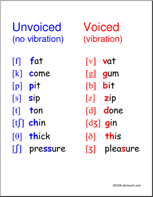

== voiced和unvoiced

- consonant分为voiced和unvoiced.
- 在英语中，所有的元音都是voiced

== e,a,o最多，且都有跟i,r,w,y的组合

== gh结尾的有四个, ough, igh, eigh, augh
- 根据rule 28，只能在单词结尾或者t前面，gh不发音或发f
- xxgh和xx直接的发音没啥关系……

=== e开头10个：

- e: be tender
- ei: their, protein, feisty
- er: her, lawyer
- ew: sew, flew
- ey: they, key
- ea: eat/tea, break, steak 一杯茶，牛奶加面包
- ear: search
- ed: 动词过去式结尾，三种发音：
** [ed]: d/t结尾发单独的音节（如traded, counted, supported, planted）
** [d]: voiced（元音和浊辅音）后面发浊音的，played, stormed, excused
** [t]:unvoiced（清辅音）后面发t, stamped, matched, financed，thanked

- ee: tree
- eigh: eight, height

=== o开头10个
o
oi
or
ow
oy
oa
oe
oo
ou
ough

=== a开头7个
a
ai
ar
aw
ay
au
augh

c开头4个
c
cei
ch
ci
ck

i开头4个
i
ie
igh
ir

